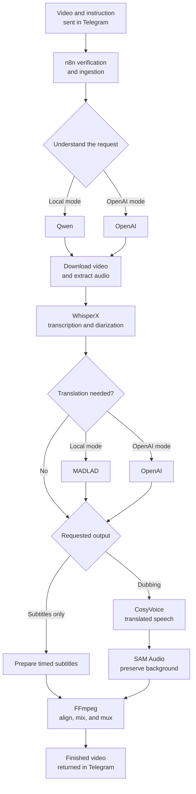
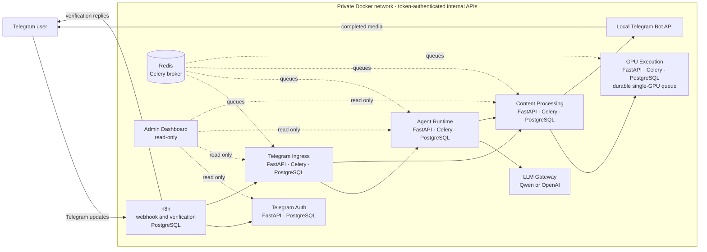

# TelegramAgent — Local-first video subtitles and dubbing through Telegram

TelegramAgent turns Telegram into a complete video translation workspace. Send a video, ask for subtitles or a dub in another language, and receive the finished file in the same conversation—without moving between upload pages, dashboards, or other apps.

The AI pipeline can run locally on your own GPU, or use OpenAI for request understanding and subtitle translation. The default deployment is designed for a single NVIDIA GPU with 16 GB of VRAM by running GPU workloads one at a time and releasing each model before the next workload starts.

## Why This Project

Translating a long video is rarely one task. It involves downloading and preparing the media, recognizing speakers, transcribing speech, translating timed text, generating new speech, preserving background audio, and assembling the final video.

TelegramAgent coordinates that entire workflow and delivers the result where the request started. Its durable queues and transactional outboxes also allow multiple users to submit long-running jobs without tying processing to a single request or browser session.

## Use Cases

- Conferences, webinars, and recorded meetings
- Lectures, courses, and employee training
- Interviews, podcasts, and creator content
- Product demonstrations and localized social videos
- Personal or family videos shared across language barriers
- Accessible subtitles for noisy environments or viewers with hearing loss

## Key Features

- **Subtitles and dubbing:** request translated subtitles, a dubbed audio track, or both.
- **Local or OpenAI language processing:** use Qwen and MADLAD locally, or connect OpenAI for request understanding and context-aware translation.
- **Speech-aware media processing:** WhisperX handles transcription, alignment, and speaker diarization.
- **Natural dubbing:** CosyVoice generates voice-conditioned translated speech while SAM Audio preserves the non-speech background.
- **Telegram-native delivery:** completed videos return directly to the original chat and remain easy to save or share.
- **Long-running job reliability:** Celery, Redis, retries, idempotent operations, cancellation, and transactional outboxes keep work durable.
- **Production-oriented service boundaries:** independently owned services, databases, migrations, workers, and authenticated internal APIs.
- **Operations visibility:** an optional read-only dashboard traces messages and media workflows across services.

## Local or OpenAI

Both modes keep transcription, dubbing, background separation, and media assembly on your machine. The selected mode changes how TelegramAgent understands the user's instruction and translates subtitles.

| Mode | Request understanding | Subtitle translation | OpenAI key |
| --- | --- | --- | --- |
| Local | Qwen | MADLAD | Not required |
| OpenAI | OpenAI | OpenAI with glossary and surrounding context | Required |

Local mode means **local AI inference**. Telegram connectivity and the initial model downloads still require internet access.

## How a Video Is Processed



For a subtitle-only request, the speech synthesis and background separation stages are skipped. For dubbing, generated speech is aligned to the original timing, mixed with the preserved background, and packaged with the subtitle track.

## Architecture at a Glance



The APIs and CPU workers can be deployed independently. In the default one-GPU setup, long GPU stages are serialized so multiple users can safely queue work without loading every model into VRAM at the same time.

## Tech Stack

- **Backend:** Python 3.11, FastAPI, Celery, Redis, PostgreSQL, SQLAlchemy, Alembic
- **AI and media:** WhisperX, Qwen, MADLAD-400, CosyVoice3, SAM Audio, FFmpeg, optional OpenAI
- **Infrastructure and integrations:** Docker Compose, NVIDIA CUDA, n8n, Telegram Bot API

## Quick Start

### 1. Prerequisites

You will need:

- A Linux host with Git, Make, Python 3.11+, Docker, and Docker Compose
- An NVIDIA GPU with approximately 16 GB of VRAM
- A working NVIDIA driver and [NVIDIA Container Toolkit](https://docs.nvidia.com/datacenter/cloud-native/container-toolkit/latest/install-guide.html)
- Internet access and enough disk space for several large model downloads
- A public HTTPS URL routed to the n8n instance

The n8n editor is exposed only on `127.0.0.1:5678` by default. Before setup, configure a reverse proxy or secure tunnel that forwards a public HTTPS address to n8n, following the [n8n webhook URL guidance](https://docs.n8n.io/hosting/configuration/configuration-examples/webhook-url/). You will enter that public base URL during `make setup`, for example `https://n8n.example.com/`.

### 2. Prepare Accounts and Model Access

Collect these values before running setup:

- **Telegram bot token:** create a bot with [BotFather](https://core.telegram.org/bots/tutorial) using `/newbot`.
- **Telegram API ID and hash:** create Telegram application credentials at [my.telegram.org/apps](https://my.telegram.org/apps). These are required by the self-hosted Telegram Bot API and are different from the bot token.
- **Hugging Face token:** create a read token under [Hugging Face access tokens](https://huggingface.co/settings/tokens).
- **Verification password:** choose the password that users must send to your bot before it accepts requests.
- **OpenAI API key:** required only when you select OpenAI mode. Create one from the [OpenAI API key page](https://platform.openai.com/api-keys).

While signed in to Hugging Face, request or accept access to each gated model used by the downloader:

- [facebook/sam-audio-small](https://huggingface.co/facebook/sam-audio-small)
- [facebook/sam-audio-judge](https://huggingface.co/facebook/sam-audio-judge)
- [pyannote/speaker-diarization-community-1](https://huggingface.co/pyannote/speaker-diarization-community-1)

SAM Audio access is manually approved and can take several hours or days. Request it before starting the model download. CosyVoice, MADLAD, Qwen, Whisper, and supporting checkpoints are downloaded as part of the same setup, but they do not currently require the approval flow above.

### 3. Clone and Configure

```bash
git clone https://github.com/amin-lotf/TelegramAgent.git
cd TelegramAgent

# Optional: create a host virtual environment with uv
uv venv
source .venv/bin/activate

make setup
```

The interactive setup will:

- Ask whether language processing should use local models or OpenAI
- Collect the Telegram, Hugging Face, webhook, verification, and admin credentials
- Create the service environment files
- Generate shared internal service tokens and secrets
- Offer to build the images, download the models, and start the stack

> `make setup` recreates the service environment files from their examples and regenerates internal secrets. Do not rerun it over a configured deployment unless you intend to replace that configuration.

If you skip the offered build, download, or startup steps, run them later:

```bash
make build
make download-models

# Start with the backend selected during setup:
make up          # Local Qwen + MADLAD mode
make up openai   # OpenAI mode
```

Model downloads are large and may take a while. Even after `make download-models` finishes, the first real request can be significantly slower while model runtimes initialize or fetch secondary assets.

### 4. Connect n8n to Telegram

After the stack starts:

1. Open [http://127.0.0.1:5678](http://127.0.0.1:5678) and create the n8n owner account.
2. Import [`workflow/telegram_request.json`](workflow/telegram_request.json).
3. Create a Telegram credential in n8n using the bot token.
4. Select that credential in the **Telegram Trigger** and Telegram send-message nodes.
5. Activate the workflow. n8n will register the Telegram webhook using the public `WEBHOOK_URL` supplied during setup.
6. Send the verification password to the bot. After it confirms access, send a video and tell it what you want.

Example requests:

```text
Add English subtitles to this video.
Dub this in Persian and include English subtitles.
Translate this meeting to Spanish.
```

The instruction can be placed in the video's caption or sent as a reply to the video message.

### 5. Monitor the First Request

```bash
make ps
make logs-n8n
make logs-celery
make logs-dubbing
```

The read-only operations dashboard is available at [http://127.0.0.1:8010](http://127.0.0.1:8010). Sign in as `admin` with the admin password selected during setup; pressing Enter during setup uses `admin` as the local default.

Stop the stack with:

```bash
make down
```

## Deployment Notes

The included Compose configuration is intended to make a complete local deployment straightforward while preserving service boundaries that can support larger installations.

For a shared, staging, or production environment:

- Replace the development database credentials.
- Terminate HTTPS at a trusted reverse proxy.
- Restrict access to n8n and the admin dashboard.
- Use read-only database roles for dashboard access.
- Scale API and CPU worker containers independently.
- Add GPU workers or GPU-specific queues deliberately; the default deployment uses exactly one serialized GPU worker.
- Process only media you have permission to translate or dub, and obtain consent before reproducing a person's voice.
