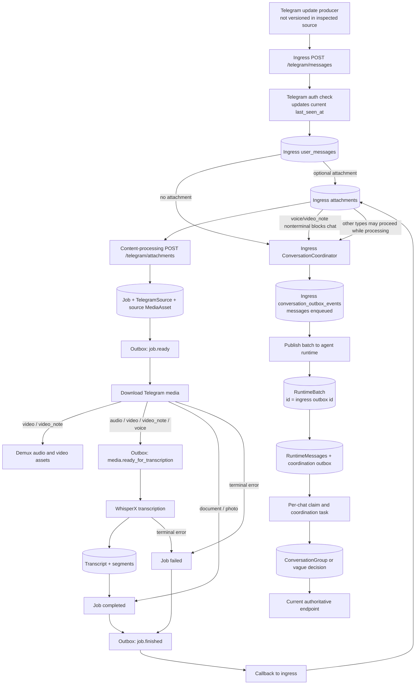
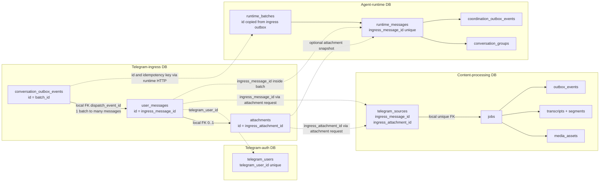

# Admin Dashboard v2: inspected architecture and implementation plan

## Scope and recommendation

This plan treats `admin_dashboard_v2` as a new service. It does not depend on, reuse, or require changes to any pre-existing dashboard implementation.

The recommended first version is a stateless, read-only FastAPI service with Jinja2 templates, vanilla JavaScript, and four independently managed SQLAlchemy Core connection pools: Telegram ingress, content processing, agent runtime, and optional Telegram-auth enrichment. It should correlate rows in application code around `telegram_ingress.user_messages.id`, not join databases at the PostgreSQL server and not import another service's ORM models.

The service needs no database of its own for v1. Admin authentication should be mandatory and configuration-backed. If multiple administrators, persistent dashboard preferences, or durable audit records become necessary later, add a dashboard-owned database then; do not mix those records into a service-owned processing database.

Deployment must be standalone:

- Add `docker/admin_dashboard_v2/Dockerfile`.
- Add `docker/admin_dashboard_v2/admin-dashboard-v2-docker-compose.yml`.
- Attach that Compose project to the existing Docker network as an external network.
- Do **not** add v2 to `docker/app/app-docker-compose.yml`.
- Do **not** add v2 to the root `docker-compose.yml` includes.

The current schemas reliably support tracing from an ingress message through attachment processing and agent-runtime conversation grouping. They do **not** contain an agent execution, an assistant response, an outgoing Telegram message, or Telegram delivery confirmation. The dashboard must end its authoritative lifecycle at agent-runtime coordination until those capabilities and persisted records exist.

## Evidence base and terminology

The conclusions below come from the current models, migrations, services, repositories, clients, Celery tasks, Docker configuration, and tests, especially:

- Telegram ingress: `src/telegram_agent/core/telegram_ingress/` and `alembic/telegram_ingress/versions/e2e9224a2f4c_create_user_message.py`.
- Content processing: `src/telegram_agent/core/content_processing/` and `alembic/content_processing/versions/6d744b6ce486_first_migration.py`.
- Agent runtime: `src/telegram_agent/core/agent_runtime/` and `alembic/agent_runtime/versions/a1b2c3d4e5f6_create_agent_runtime_tables.py`.
- Telegram auth: `src/telegram_agent/core/telegram_auth/` and `alembic/telegram_auth/versions/757b00ccbf99_first_migration.py`.
- Deployment: `docker-compose.yml`, `docker/app/app-docker-compose.yml`, `docker/app/celery-docker-compose.yml`, `docker/storage/storage-docker-compose.yml`, and the checked-in `.env.*.example` files.
- Integration-test database pattern: `tests/conftest.py`.

“Message ID” is ambiguous in this system, so the dashboard and its code should use explicit labels:

- **Telegram message ID**: `message_id`, scoped to `chat_id`.
- **Ingress message ID**: `telegram_ingress.user_messages.id`, a UUID and the main cross-service key.
- **Runtime message ID**: `agent_runtime.runtime_messages.id`, a different UUID.
- **Batch ID**: the ingress conversation-outbox UUID reused as `agent_runtime.runtime_batches.id`.
- **Runtime conversation group ID**: `agent_runtime.conversation_groups.id`; this is a semantic grouping decision, not a Telegram album ID.

## 1. Current data-flow reconstruction

### 1.1 Entry and authorization

The repository exposes `POST /api/v1/telegram/messages` through `receive_telegram_message()` in `src/telegram_agent/core/telegram_ingress/api/v1/messages/router.py`. The request schema `TelegramUserRequest` carries `telegram_user_id`, `chat_id`, `message_id`, optional `update_id`, `reply_to_message_id`, text/caption, and at most one attachment (`src/telegram_agent/core/telegram_ingress/api/v1/messages/schemas.py`). No Telegram-origin message timestamp or `media_group_id` is accepted.

Before persistence, the ingress route calls `TelegramAuthClient.check_user()` (`src/telegram_agent/core/common/clients/telegram_auth.py`). Telegram auth looks up the current `telegram_users` row and updates `last_seen_at` when the user is active (`UserAuthenticationService.check_user()` and `SqlAlchemyTelegramUserRepository.update_last_seen()` under `src/telegram_agent/core/telegram_auth/`). The auth database is therefore useful for current user-name enrichment, but it is not a message-history database and its profile fields are not historical snapshots.

The producer that receives the original Telegram update is not versioned in the inspected Python source. The deployment contains n8n with externally persisted workflow data (`docker/n8n/n8n-docker-compose.yml`), but no checked-in workflow establishes the exact update-to-ingress mapping. The first authoritative, inspectable message boundary is therefore the ingress HTTP request.

### 1.2 Ingress persistence and idempotency

`AsyncUserMessageService.create_user_message()` in `src/telegram_agent/core/telegram_ingress/services/async_user_message.py` first saves a `UserMessage` and optional `Attachment` in an ingress unit of work. `AsyncSqlAlchemyTelegramIngressUnitOfWork.__aexit__()` commits the transaction (`src/telegram_agent/core/telegram_ingress/db/uow/async_telegram_ingress.py`).

The ingress identifiers are:

- `UserMessage.id`: generated UUID; the durable internal message identity.
- `Attachment.id`: generated UUID; created only when the request has an attachment.
- `update_id`: Telegram update identifier when supplied.
- `(chat_id, message_id)`: durable Telegram message identity within a chat.

`AsyncSqlAlchemyUserMessageRepository.get_existing()` checks `update_id` first and falls back to `(chat_id, message_id)` (`src/telegram_agent/core/telegram_ingress/db/repositories/async_user_message.py`). Database unique constraints enforce both forms. A duplicate request returns the existing message and does not redispatch content work or coordination.

Each ingress message can own zero or one attachment. `Attachment.user_message_id` is a unique foreign key, and the ORM relationship is `uselist=False` (`src/telegram_agent/core/telegram_ingress/db/models/user_message.py`). Multiple attachments in one Telegram message are not representable.

### 1.3 Messages without attachments

After saving a text message, `AsyncUserMessageService` immediately calls `ConversationCoordinator.coordinate(chat_id)`.

`ConversationCoordinator` (`src/telegram_agent/core/telegram_ingress/services/conversation_coordinator.py`) performs these steps in one ingress transaction:

1. Acquires a PostgreSQL transaction-scoped advisory lock for the chat.
2. Loads **all** pending ingress messages for that chat in ascending Telegram message order.
3. Builds `RuntimeMessageBatchPayload`, preserving each ingress UUID, Telegram user/message/reply IDs, text, and any attachment snapshot.
4. Creates one `ConversationOutboxEvent` unless the deterministic idempotency key already exists.
5. Sets every included `UserMessage.conversation_status` to `enqueued` and sets `dispatch_event_id` to that event UUID.

The idempotency key hashes the ordered ingress UUIDs, not Telegram message IDs. Several independently received Telegram messages can therefore become one ingress batch. `tests/telegram_ingress/test_conversation_coordinator.py` verifies ordered batching, whole-chat blocking, and non-overlapping concurrent coordination.

The Celery poller `telegram_ingress.outbox.publish` invokes `OutboxPublisher` (`src/telegram_agent/core/telegram_ingress/services/outbox_publisher.py`). It claims events with a lease and sends the stored batch to agent runtime using `AgentRuntimeClient.submit_message_batch()` (`src/telegram_agent/core/telegram_ingress/clients/agent_runtime.py`). It passes:

- `batch_id = conversation_outbox_events.id`;
- the same ingress outbox `idempotency_key` as the HTTP idempotency header;
- the full message payload.

On runtime acceptance, the ingress event becomes `published`, `published_at` is set, and all related ingress messages become `dispatched`. Retryable transport failures return the same outbox row to `pending`, increment `attempt_count`, set `available_at`, and retain `last_error`. A permanent publication failure marks both the outbox and related ingress messages `failed`.

### 1.4 Messages with attachments

After the ingress message/attachment transaction commits, `AsyncUserMessageService._dispatch_attachment()` calls content processing with `ProcessAttachmentCommand`. That command carries both ingress UUIDs, Telegram user/file identifiers, attachment type, callback requirement, and the deterministic key:

`telegram-ingress:process-attachment:{attachment_type}:{ingress_attachment_id}:v1`

The transfer is defined by `ProcessAttachmentCommand.create()` in `src/telegram_agent/core/telegram_ingress/common/commands.py` and `ContentProcessingClient.process_attachment()` in `src/telegram_agent/core/telegram_ingress/clients/content_processing.py`.

If content processing accepts the request, ingress changes the attachment from `pending` to `processing`. If the HTTP operation ultimately fails or returns an invalid response, ingress changes it to `failed`; ingress has no attachment error field or status-change timestamp. Because an accepted remote request can outlive a lost HTTP response, a content job can exist even while ingress says `failed`.

Content processing's `AsyncTelegramJobService.create_job()` (`src/telegram_agent/core/content_processing/services/async_telegram_job_service.py`) transactionally creates:

- `jobs`: one queued Telegram-attachment job;
- `telegram_sources`: the source-specific bridge containing `ingress_message_id` and `ingress_attachment_id`;
- `media_assets`: one `source` asset with no path yet;
- `outbox_events`: `content_processing.job.ready`, which schedules the download stage.

The caller-supplied idempotency key is unique, so normal ingress retries reuse one job. The schema does not make either ingress UUID unique in `telegram_sources`; a different idempotency key can create another job for the same ingress attachment.

`OutboxDispatcher` (`src/telegram_agent/core/content_processing/services/outbox_dispatcher.py`) converts content outbox facts into Celery work:

- `content_processing.job.ready` → `telegram.download`;
- `content_processing.media.ready_for_transcription` → `media.transcribe`;
- `content_processing.job.finished` → `telegram_ingress.processing_result`.

An outbox event is marked `published` when its Celery task is enqueued, not when that task succeeds.

`SyncTelegramMediaDownloadService` (`src/telegram_agent/core/content_processing/services/sync_telegram_media_download.py`) claims a queued/stale-running job, downloads the Telegram media, and updates the source asset's path, size, and MIME type. For `video` and `video_note`, `MediaDemuxer` creates separate derived `audio` and `video` assets linked through `parent_asset_id`. For `audio`, `video`, `video_note`, and `voice`, the job moves to `downloaded` and a transcription outbox event is created. For `document` and `photo`, download completes the job directly.

`SyncTranscriptionService` (`src/telegram_agent/core/content_processing/services/sync_transcription_service.py`) claims a downloaded/stale-transcribing job, uses the derived audio asset when present, calls WhisperX with `request_id = job.id`, persists one `Transcript` plus ordered `TranscriptSegment` rows, marks the job completed, and creates the terminal callback outbox event. WhisperX is stateless from the dashboard's perspective; there is no WhisperX-owned database in the repository.

Download/transcription task retries are Celery retries (`src/telegram_agent/core/content_processing/celery/tasks/media_download.py` and `transcription.py`). Retryable failures move the same job back to `queued` or `downloaded` and overwrite `jobs.error_message`; Celery's retry count/history is not persisted in the content database. The job is marked `failed` after retry exhaustion or a permanent error.

The callback task resolves the original two ingress UUIDs from `telegram_sources` and calls ingress (`SyncTelegramIngressCallbackService` and `TelegramIngressClient` under `src/telegram_agent/core/content_processing/`). A completed voice/video-note includes transcript text; other types do not send transcription text to ingress. `AsyncAttachmentProcessingResultService.apply()` (`src/telegram_agent/core/telegram_ingress/services/async_attachment_processing_result.py`) validates both UUIDs, changes the ingress attachment to `ready` or `failed`, copies transcript text into the ingress message for voice/video-note, and reruns chat coordination.

The callback outbox row only proves the callback task was enqueued. Callback delivery retries live in Celery and no database column records successful callback delivery or its timestamp. Ingress attachment state is the best evidence that the callback was applied, but it has no `updated_at`.

### 1.5 Attachment blocking and parallel lifecycle behavior

Only `voice` and `video_note` block ingress conversation dispatch while their attachment state is nonterminal. `ConversationCoordinator._has_blocking_attachment()` treats `ready` and `failed` as terminal. A pending voice/video-note blocks **all** pending messages in that chat, as verified in `tests/telegram_ingress/test_conversation_coordinator.py`.

`video`, `audio`, `document`, and `photo` do not block. They can be sent to agent runtime while content processing is still running. The runtime row then holds a snapshot such as `attachment_status = processing`. `AsyncMessageBatchIngestionService` explicitly treats that field as mutable/non-identity data but no status-update path currently exists (`src/telegram_agent/core/agent_runtime/services/async_message_batch_ingestion.py`). The dashboard must not draw a falsely linear timeline for these types and must prefer the current ingress/content state over the runtime snapshot.

### 1.6 Agent runtime coordination

Agent runtime receives the ingress batch at `submit_message_batch()` (`src/telegram_agent/core/agent_runtime/api/v1/messages/router.py`). `AsyncMessageBatchIngestionService` transactionally creates:

- `RuntimeBatch.id` equal to the ingress conversation-outbox UUID;
- one `RuntimeMessage` per ingress message;
- one `ConversationClaim` per chat if absent;
- one `coordination_outbox_events` row per runtime message.

`RuntimeMessage.ingress_message_id` and `(chat_id, message_id)` are both unique. Retries of the same batch are accepted only when immutable contents match; a conflicting ingress UUID or batch is rejected. Each runtime message's coordination event uses `agent_runtime:coordinate:{ingress_message_id}:v1` and also includes ingress/chat/message identifiers in JSON.

`CoordinationOutboxDispatcher` claims eligible chats, not individual logical messages, and enqueues `agent_runtime.coordinate_conversation` (`src/telegram_agent/core/agent_runtime/services/coordination_outbox_dispatcher.py`). The current claim path leaves per-message outbox rows pending while `conversation_claims.status = claimed`; the claim row is therefore the best evidence of active work.

`SyncMessageGroupCoordinationService` processes pending messages in Telegram message order (`src/telegram_agent/core/agent_runtime/services/sync_message_group_coordination.py`). The current `HeuristicMessageGroupCoordinator` (`src/telegram_agent/core/agent_runtime/coordinators/heuristic.py`) does the following:

- starts a new group when no prior successfully grouped message exists;
- attaches a reply to the replied-to message's group when that message is in the recent window;
- attaches an attachment-only message to the latest group when possible;
- marks certain context-free text as `vague`;
- otherwise reuses the latest group or creates a new one.

Successful decisions set `RuntimeMessage.coordination_status` to `grouped` or `vague`, set `coordinated_at`, and mark the message's coordination outbox event `published`. Retryable failures increment that event's `attempt_count` and schedule it again. Permanent coordination errors atomically mark the message `vague` and the event `failed`; a `vague` message is therefore not a failure unless its outbox row is also failed.

`ConversationGroup` is a semantic runtime grouping with a per-chat sequential `group_number`. It is not a Telegram album and does not prove messages arrived in the same Telegram media group.

### 1.7 Current endpoint of the flow

No inspected model, migration, service, repository, task, or client persists or executes:

- an agent/model request;
- an agent execution attempt;
- an assistant response;
- an outgoing Telegram message;
- a Telegram send/delivery result.

Accordingly, stages such as “agent execution completed”, “outgoing response prepared”, and “Telegram response sent” must be shown as **not implemented / no source of truth**, not “not started”. They should not affect the v1 overall state.

### 1.8 Current message-flow diagram



## 2. Database inventory

### 2.1 Deployment-level database ownership

`docker/storage/storage-docker-compose.yml` defines four PostgreSQL 16 containers. Each uses database name `telegram_agent`, but they are different PostgreSQL servers/volumes and therefore different service-owned databases:

| Owner | Docker host/service | Migration section | Application configuration |
|---|---|---|---|
| Telegram auth | `telegram_auth_postgres` | `alembic -n telegram_auth` | `Settings.sqlalchemy_database_url` in `src/telegram_agent/core/telegram_auth/common/settings.py`; example in `docker/app/.env.telegram_auth.docker.example` |
| Telegram ingress | `telegram_ingress_postgres` | `alembic -n telegram_ingress` | `Settings.sqlalchemy_database_url` in `src/telegram_agent/core/telegram_ingress/common/settings.py`; example in `docker/app/.env.telegram_ingress.docker.example` |
| Content processing | `content_processing_postgres` | `alembic -n content_processing` | `Settings.sqlalchemy_database_url` in `src/telegram_agent/core/content_processing/common/settings.py`; example in `docker/app/.env.content_processing.docker.example` |
| Agent runtime | `agent_runtime_postgres` | `alembic -n agent_runtime` | `Settings.sqlalchemy_database_url` in `src/telegram_agent/core/agent_runtime/common/settings.py`; example in `docker/app/.env.agent_runtime.docker.example` |

`alembic.ini` has separate migration sections and each `alembic/<service>/env.py` loads only that service's models. There are no cross-database foreign keys.

### 2.2 Telegram ingress database

Models: `UserMessage` and `Attachment` in `src/telegram_agent/core/telegram_ingress/db/models/user_message.py`; `ConversationOutboxEvent` in `db/models/outbox.py`. Migration: `alembic/telegram_ingress/versions/e2e9224a2f4c_create_user_message.py`.

| Table / model | Keys and relationships | State and errors | Times | Correlation and JSON | Important indexes |
|---|---|---|---|---|---|
| `user_messages` / `UserMessage` | PK `id` UUID; unique `(chat_id,message_id)`; unique nullable `update_id`; nullable FK `dispatch_event_id -> conversation_outbox_events.id` with `SET NULL` | `conversation_status`: `pending`, `enqueued`, `dispatched`, `failed`; no error field | `created_at` only | `telegram_user_id`, `chat_id`, Telegram `message_id`, `update_id`, logical `reply_message_id`, `dispatch_event_id` | `chat_id`, `telegram_user_id`, `dispatch_event_id`; partial `(chat_id,message_id)` for pending; no recent-message/date index |
| `attachments` / `Attachment` | PK `id`; unique FK `user_message_id -> user_messages.id` with cascade | `status`: `pending`, `processing`, `ready`, `failed`; no error field | `created_at` only | `file_id`, nullable `file_unique_id`, attachment `type` | unique `user_message_id`, `file_unique_id` |
| `conversation_outbox_events` / `ConversationOutboxEvent` | PK `id`; unique `idempotency_key`; referenced by one or more messages | `status`: `pending`, `processing`, `published`, `failed`; `attempt_count`, `available_at`, `locked_*`, `last_error` | `created_at`, nullable `published_at`, `locked_at` | `chat_id`, `first_message_id`; JSONB `payload` contains all batched ingress message/attachment IDs and snapshots | `chat_id`; partial pending `(available_at,created_at)` and processing lease `locked_at` |

The authoritative relationship from a message to its batch is the `dispatch_event_id` FK. The JSON payload duplicates the message UUIDs for transport and debugging.

### 2.3 Content-processing database

All models are in `src/telegram_agent/core/content_processing/db/models/content_processing.py`. Migration: `alembic/content_processing/versions/6d744b6ce486_first_migration.py`.

| Table / model | Keys and relationships | State and errors | Times | Correlation and JSON | Important indexes |
|---|---|---|---|---|---|
| `jobs` / `Job` | PK `id`; unique `idempotency_key` | `kind = telegram attachment`; `status`: `queued`, `running`, `downloaded`, `transcribing`, `completed`, `failed`, `cancelled`; current `error_message`; `callback_required` | `created_at`, `updated_at` | Canonical ingress-generated idempotency key embeds attachment UUID/type | unique index on `idempotency_key`; no status/date index |
| `telegram_sources` / `TelegramSource` | PK `id`; unique FK `job_id -> jobs.id` cascade | no status/error | no timestamps | indexed `ingress_message_id`, `ingress_attachment_id`, `telegram_user_id`; Telegram file IDs and `attachment_type` | unique `job_id`; ingress UUID, user, and file-unique indexes |
| `media_assets` / `MediaAsset` | PK `id`; FK `job_id` cascade; nullable self-FK `parent_asset_id` with `SET NULL`; unique `(job_id,role)` | role `source`, `audio`, `video`; path/media/MIME/duration/size fields | no timestamps | `job_id`, parent asset | `job_id`, `parent_asset_id`, unique `(job_id,role)` |
| `transcripts` / `Transcript` | PK `id`; unique FK `job_id` with `RESTRICT` | transcript text, language/probability, duration | no timestamps | `job_id` | unique/indexed `job_id` |
| `transcript_segments` / `TranscriptSegment` | PK `id`; FK `transcript_id` cascade; unique `(transcript_id,segment_index)` | segment text, range, language, speaker/confidence | no timestamps | transcript-local identifiers only | `transcript_id`; `(transcript_id,start_ms,end_ms)` |
| `outbox_events` / `OutboxEvent` | PK `id`; FK `job_id` cascade; unique `idempotency_key` | same four outbox states; attempt/lease/error fields | `created_at`, `available_at`, nullable `published_at`, `locked_at` | `job_id`; JSONB `payload` is currently `{}` for all created event types | `job_id`; partial pending and processing-lease indexes |

Media, source, transcript, and segment rows have no creation/update timestamp. A job's `updated_at` is only its latest state-change time, not a history of every stage.

### 2.4 Agent-runtime database

Models: `src/telegram_agent/core/agent_runtime/db/models/runtime.py`. Migration: `alembic/agent_runtime/versions/a1b2c3d4e5f6_create_agent_runtime_tables.py`.

| Table / model | Keys and relationships | State and errors | Times | Correlation and JSON | Important indexes |
|---|---|---|---|---|---|
| `runtime_batches` / `RuntimeBatch` | PK `id` supplied by ingress; unique `idempotency_key` | no status/error | `created_at` | `id = ingress conversation_outbox_events.id`; `chat_id`; ingress idempotency key | `chat_id`, unique idempotency key |
| `runtime_messages` / `RuntimeMessage` | PK `id`; FK `batch_id` cascade; composite FK `(group_id,chat_id)` to group; unique `ingress_message_id`; unique `(chat_id,message_id)` | `coordination_status`: `pending`, `grouped`, `vague`; attachment status is a copied string | `created_at`, nullable `coordinated_at` | ingress UUID, Telegram IDs/text/reply, optional ingress attachment UUID/type/file IDs, `group_id` | `batch_id`, `chat_id`, `group_id`; chat/message order; partial pending and grouped-order indexes; unique constraints supply lookup indexes |
| `conversation_groups` / `ConversationGroup` | PK `id`; unique `(chat_id,group_number)` and `(id,chat_id)` | no status/error | `created_at` | per-chat group number | `chat_id`, unique composites |
| `conversation_claims` / `ConversationClaim` | PK `chat_id`; partial-unique `claim_token` | `idle`/`claimed`; current lease owner only | `available_at`, `updated_at`, nullable `locked_at` | chat-scoped, ephemeral claim token | available queue, claimed lease, partial unique token |
| `coordination_outbox_events` / `OutboxEvent` | PK `id`; unique FK `runtime_message_id` cascade; unique `idempotency_key` | four outbox states, attempts, lease, last error | `created_at`, `available_at`, nullable `published_at`, `locked_at` | `chat_id`, runtime UUID, Telegram `message_id`; JSONB repeats ingress/chat/message IDs | `chat_id`, `runtime_message_id`; partial pending order/availability and processing lease |

There is a schema-definition mismatch to resolve before relying on model-generated DDL: the ORM declares the runtime message/group composite FK as `ondelete="RESTRICT"`, while the actual migration creates `ondelete="SET NULL"`. Dashboard readers must target the migrated database behavior, and an existing-service follow-up should align the model and migration in a separate change. This does not block read correlation.

### 2.5 Telegram-auth database

Model: `TelegramUser` in `src/telegram_agent/core/telegram_auth/db/models/telegram_user.py`. Migration: `alembic/telegram_auth/versions/757b00ccbf99_first_migration.py`.

`telegram_users` has integer PK `id`, unique/indexed `telegram_user_id`, indexed `chat_id`, current username/name/language/bot/active fields, and `verified_at`/`last_seen_at`. It has no message foreign key, message timestamp, or history. Correlation to ingress is logical through `telegram_user_id`; `chat_id` can be checked but the user row's chat is mutable during re-verification.

### 2.6 Infrastructure databases not recommended as dashboard sources

n8n owns a separate PostgreSQL database in `docker/storage/storage-docker-compose.yml`. Its workflow definitions/data are on external volumes and no checked-in application contract exposes message correlation. Querying n8n internals would couple the dashboard to an infrastructure product schema and should not be part of v1.

WhisperX has no service-owned persistence in this repository. Its result is authoritatively represented by content-processing transcript rows.

## 3. Cross-service correlation map

### 3.1 Relationship table

| Source service/table.field | Destination service/table.field | Transfer mechanism | Cardinality and retries | Reliability |
|---|---|---|---|---|
| Ingress `user_messages.telegram_user_id` | Auth `telegram_users.telegram_user_id` | Original request; auth checked before ingress save | Many messages to one current user row | Guaranteed identifier on ingress; auth row optional if deleted/revoked; profile is current, not historical |
| Ingress `user_messages.id` | Content `telegram_sources.ingress_message_id` | `ProcessAttachmentCommand` HTTP payload | Zero-to-many content jobs; normal idempotent path is zero/one | Strong logical key when attachment request reaches content; no cross-DB FK and source field is not unique |
| Ingress `attachments.id` | Content `telegram_sources.ingress_attachment_id` | Same command | Zero-to-many; same caveat | Strong logical key; canonical idempotency prevents normal duplicates but schema allows them |
| Ingress attachment type/id | Content `jobs.idempotency_key` | Deterministic command key | Normally one key/job per attachment | Guaranteed for requests created by current ingress; string parsing is a secondary check, not primary correlation |
| Content `telegram_sources.job_id` | Content `jobs.id` | Local FK | Exactly one source per job by unique FK | Enforced |
| Content `media_assets.job_id`, `outbox_events.job_id`, `transcripts.job_id` | Content `jobs.id` | Local FKs | One-to-many assets/events; zero/one transcript | Enforced |
| Ingress `conversation_outbox_events.id` | Agent `runtime_batches.id` | Sent explicitly as `batch_id` | Zero/one runtime batch; HTTP retries reuse same ID | Guaranteed once runtime accepts the batch |
| Ingress outbox `idempotency_key` | Agent `runtime_batches.idempotency_key` | HTTP `Idempotency-Key` header | One-to-one with batch | Guaranteed and unique in both databases |
| Ingress `user_messages.id` | Agent `runtime_messages.ingress_message_id` | Message within runtime batch payload | Zero/one | Guaranteed after accepted ingestion; unique in runtime |
| Ingress `(chat_id,message_id)` | Agent `(runtime_messages.chat_id,message_id)` | Batch payload | Zero/one | Enforced unique in both databases; useful verification/fallback, but ingress UUID is preferred |
| Ingress `attachments.id` | Agent `runtime_messages.attachment_ingress_id` | Batch attachment snapshot | Zero/one runtime message | Optional; no runtime index and state may be stale |
| Ingress `user_messages.dispatch_event_id` | Ingress `conversation_outbox_events.id` | Coordinator transaction | Many messages to one batch event | Local FK; enforced when non-null |
| Agent `runtime_messages.batch_id` | Agent `runtime_batches.id` | Ingestion transaction | Many messages to one batch | Enforced FK |
| Agent `runtime_messages.group_id,chat_id` | Agent `conversation_groups.id,chat_id` | Coordination decision | Many messages to one group; vague messages have none | Local composite FK; migrated delete rule is `SET NULL` |
| Agent `coordination_outbox_events.runtime_message_id` | Agent `runtime_messages.id` | Ingestion transaction | Exactly zero/one, normally one | Enforced FK plus unique constraint |
| Content source ingress UUIDs | Ingress callback request UUIDs | Content callback HTTP payload | Multiple callback attempts target same ingress rows | Identifiers guaranteed; callback-attempt/delivery history is not persisted |

### 3.2 Cross-database relationship diagram



### 3.3 Identifier origin table

| Identifier | Origin | Persisted in / transferred to | Meaning and constraints |
|---|---|---|---|
| `update_id` | Telegram update producer | Ingress `user_messages.update_id` | Optional, globally unique when present; not passed downstream |
| `telegram_user_id` | Telegram | Auth, ingress, content source, runtime message | Stable user identity; content/runtime copies are logical only |
| `chat_id` | Telegram | Auth, ingress, ingress outbox, runtime batch/message/group/claim/outbox | Message-ID scope and ordering domain; absent from content source because ingress UUID is sufficient |
| Telegram `message_id` | Telegram | Ingress, ingress payload/outbox, runtime message/outbox | Unique only with `chat_id` |
| `reply_message_id` | Telegram | Ingress and runtime message | Logical same-chat link; no FK; used by grouping heuristic |
| Ingress message UUID | `UserMessage` default UUID | Content `telegram_sources`, ingress outbox JSON, runtime message/outbox JSON | Primary end-to-end trace key |
| Ingress attachment UUID | `Attachment` default UUID | Content source, runtime attachment snapshot | One per ingress message at most |
| Telegram `file_id` / `file_unique_id` | Telegram | Ingress attachment, content source, runtime snapshot | File fetch/correlation data; mask `file_id` in UI by default |
| Content job UUID | `Job` default UUID | All content child rows; WhisperX `request_id` | Content-local aggregate identifier; not stored in ingress |
| Content request idempotency key | Ingress command factory | Content job | Canonically embeds attachment type/UUID; unique |
| Ingress conversation outbox UUID | Ingress coordinator | Agent `runtime_batches.id` | Also the runtime HTTP `batch_id`; strongest batch link |
| Ingress conversation idempotency key | Ingress coordinator | Agent runtime batch | Hash of ordered ingress UUIDs; unique in each DB |
| Runtime message UUID | Agent ingestion | Agent coordination outbox | Runtime-local message identity |
| Runtime group UUID / group number | Agent coordinator | Runtime message | Semantic conversation group; number unique per chat; not Telegram album identity |
| Runtime coordination event UUID | Agent ingestion | Agent DB only | One event per runtime message; retries mutate the row |
| Conversation claim token | Agent dispatcher | `conversation_claims` and task argument | Ephemeral lease token, cleared after release; not durable trace identity |

There is no separate coordination-request ID or persisted agent-execution request ID beyond batch/message/outbox coordination identifiers.

## 4. Relationship and traceability problems

| Severity | Problem | Operational consequence | Recommendation |
|---|---|---|---|
| **Blocking for the proposed later stages** | No agent execution, assistant response, outgoing Telegram message, or send result exists in inspected code/schema | The dashboard cannot truthfully show execution or response delivery | End v1 at runtime coordination. When those workflows are built, persist ingress message/group correlation and attempt/send timestamps in their owning services |
| **Blocking for album fidelity** | Ingress does not accept/store Telegram `media_group_id`; one message has at most one attachment | Telegram albums cannot be authoritatively reconstructed; sequential runtime grouping is not equivalent | Only add `media_group_id` if exact album debugging is a requirement; otherwise label current limitation |
| **Important** | No Telegram-origin sent timestamp | `user_messages.created_at` is database ingestion time, not the Telegram message time | Label UI as “ingested at”; add nullable `telegram_sent_at` only if true source timing is required |
| **Important** | Content callback enqueue is persisted but callback attempts/success are not | Cannot distinguish callback task enqueued, retrying, permanently logged failure, and delivered except by current ingress attachment state | v1 shows “callback enqueued” plus “result observed by ingress” separately and marks observation time unknown |
| **Important** | Ingress attachment has no error or `updated_at` | A `failed` attachment does not explain whether HTTP dispatch or processing failed, and callback time is unknown | Correlate content rows when available; do not invent an error. Consider future error code/timestamp only if operations require it |
| **Important** | Content download/transcription retries live in Celery; job holds only current status/error | Previous attempts, retry count, original error, and exact attempt timing are lost; retry exhaustion overwrites detail | Show “attempt history unavailable”; do not present `outbox_events.attempt_count` as media-stage retry count |
| **Important** | Successful outbox publication clears `last_error` in all three services | `attempt_count > 0` proves prior retries, but their error texts are lost | Display attempt count and “previous error no longer retained” |
| **Important** | Assets, sources, transcripts, and segments lack timestamps | Download/demux/transcription row creation cannot be placed exactly on a chronology | Use outbox `created_at`, job current state/`updated_at`, and row existence with explicit “time unavailable” labels |
| **Important** | Runtime attachment status is a one-time copy with no update path | Nonblocking media often remains `processing` in runtime after content/ingress is terminal | Treat it as “status at runtime ingestion”; current state comes from ingress/content |
| **Important** | `telegram_sources.ingress_message_id` and `ingress_attachment_id` are not unique | Different idempotency keys can create multiple jobs; no `active`/`superseded` marker exists | Load and show all jobs. Mark the canonical-key job as expected; never silently discard other attempts |
| **Important** | Recent ingress listing/date filtering lacks a `(created_at,id)` index; status filtering is also weakly indexed | A production sidebar can sort/scan the entire table and affect ingress | Add a small ingress migration with a descending recent-message index before production scale; add status-leading index only if query plans justify it |
| **Important** | Telegram `message_id` is not globally unique and has no standalone index | A filter by message ID alone is ambiguous and may scan | Require/encourage `chat_id + message_id`; label multi-match global lookup and consider an index only if operators need it often |
| **Important** | Agent model and migration disagree on group FK deletion (`RESTRICT` vs `SET NULL`) | Model assumptions differ from deployed schema | Align in a separate agent-runtime maintenance change; dashboard uses actual migrated schema |
| **Nice to improve** | No explicit deleted, superseded, or active-attempt fields; no code deletion paths found | Manual/retention deletion can remove trace parts; absence is ambiguous | Represent missing vs unavailable vs not-started; add retention-aware tombstones only if deletion is introduced |
| **Nice to improve** | `JobStatus.CANCELLED` exists but no inspected transition uses it | Cancelled is representable but currently unexplained | Render if encountered; do not design cancellation controls in a read-only dashboard |
| **Nice to improve** | Auth profile is current and mutable | Sidebar user names may not match the name at message time | Label as current auth profile; use ingress Telegram ID as durable identity |
| **Nice to improve** | Outbox payloads duplicate IDs/text/file data | Raw JSON can expose sensitive content and can drift from current rows | Structured views use columns/current records; raw payload is sanitized and collapsed |
| **Nice to improve** | No checked-in producer/outgoing n8n workflow contract | Lifecycle before ingress is not reconstructable from repository source | Treat ingress persistence as the first authoritative stage |

No outbox cleanup/deletion implementation was found. Current records remain traceable unless they are manually deleted or a future retention policy is added. Cascades mean deleting a content job removes source/assets/outbox rows, deleting an ingress message removes its attachment, and deleting a runtime batch removes its runtime messages/events.

## 5. Proposed dashboard data model

### 5.1 Persistence decision

Use **no dashboard database** in v1:

- service databases remain the sources of truth;
- admin credentials/configuration come from secrets/environment;
- view models exist only for a request;
- no cache or background indexer is required initially;
- no dashboard migrations are required.

An optional later indexing service is justified only after measuring query volume/latency or if cross-service historical search must remain fast at much larger scale. Such an index would consume service-owned events or perform bounded polling into a dashboard-owned store; it would still not become processing state.

### 5.2 Application view model

Define immutable Pydantic/dataclass view models independent of database rows:

- `MessageIdentityView`: ingress UUID, chat ID, Telegram message/update/reply IDs, Telegram user ID.
- `TelegramMessageView`: text preview/full text, ingestion time, current auth-profile enrichment, redaction flags.
- `AttachmentTraceView`: ingress attachment identity/current state plus all matched content attempts and the runtime snapshot.
- `IngressTraceView`: message, attachment, dispatch batch, batch siblings, ingress outbox state/errors/times.
- `ContentJobAttemptView`: job/source, assets, transcript summary/segments, content outbox events, current error, canonical-key flag.
- `RuntimeTraceView`: batch, runtime message, conversation group and bounded group siblings, claim snapshot, coordination outbox.
- `TimelineEventView`: stable stage key, service, label, state, optional timestamp, evidence/reason, attempt count, record links.
- `TraceFailureView`: service/stage, severity, retained error text, record ID.
- `DataSourceState`: `available`, `record_not_found`, `unavailable`, `timed_out`, or `invalid_schema`, with a sanitized diagnostic.
- `MessageTraceView`: identity, service sections, ordered timestamped events, untimed stage-state ladder, failures, warnings, and source availability.

Stage state must support at least `not_applicable`, `not_started`, `pending`, `completed`, `failed`, `unknown`, and `not_implemented`. Database availability is orthogonal; an unavailable database must not be represented as “not started”.

### 5.3 Overall-state rule

Compute a display-only state with documented precedence:

1. `failed` if any authoritative current stage is failed (attachment, job, or outbox).
2. `pending`/`processing` if any applicable authoritative stage is nonterminal.
3. `coordinated` when the runtime message is grouped or deliberately vague and its event is not failed.
4. `dispatched` when ingress is published but runtime evidence is not yet visible.
5. `received`/`enqueued` for earlier ingress states.
6. Add an independent `partial data` warning when any source is unavailable.

Do not call a trace “completed” because no current source proves a user response was sent.

## 6. Query strategy

### 6.1 Connection and query boundary

Create one async engine per database with separate settings and pools. Every reader owns queries for one service only. A `MessageTraceQueryService` coordinates readers and joins returned DTOs in Python. Use `asyncio.gather(..., return_exceptions=True)` for independent detail queries and translate each failure into `DataSourceState`.

Use explicit SQLAlchemy Core `Table` mappings with a separate `MetaData` per service. This is preferable to:

- importing service ORM models, which shares metadata and deployment contracts;
- runtime reflection, which makes startup depend on every database and hides schema drift until runtime;
- server-side cross-database joins, which the deployment does not support;
- writable ORM sessions, which add accidental flush/write risk.

Mappings should include only columns the dashboard reads. Contract tests against migrated databases detect drift.

### 6.2 Recent message list

Anchor the sidebar in ingress `user_messages`. Use keyset pagination ordered by `(created_at DESC, id DESC)`, not offset pagination. The opaque cursor contains the last pair and the active filter fingerprint; validate/tamper-protect it.

One ingress query should outer-join the one-to-one attachment (or use a bounded second `IN` query). For each page-sized candidate chunk, bulk query other databases:

- auth: `telegram_user_id IN (...)`;
- content: `telegram_sources.ingress_message_id IN (...)` joined to jobs;
- runtime: `runtime_messages.ingress_message_id IN (...)` with group/outbox state.

Map results by ingress UUID. Never issue a per-message query.

Recommended pre-production ingress index:

`user_messages (created_at DESC, id DESC)`

For frequent ingress-state filtering, measure and potentially add:

`user_messages (conversation_status, created_at DESC, id DESC)`

Do not add indexes speculatively to content/agent databases until `EXPLAIN (ANALYZE, BUFFERS)` on representative data confirms need. Existing exact ingress UUID indexes in `telegram_sources` and the runtime unique constraint are sufficient for page enrichment.

### 6.3 Filters supported by current schemas

| Filter | v1 support | Notes |
|---|---|---|
| Ingress message UUID | Yes, exact | PK lookup; best deep link |
| Chat ID | Yes | Indexed in ingress |
| Telegram message ID | Yes with chat ID; optional multi-match global lookup | Telegram ID is chat-scoped; no standalone ingress index |
| Update ID | Yes, exact | Unique constraint |
| Telegram user ID | Yes | Indexed in ingress |
| Runtime group/conversation UUID | Yes | Resolve indexed runtime `group_id` to ingress UUIDs, then load ingress rows; label as runtime group |
| Runtime batch ID | Yes | It is also ingress outbox UUID |
| Content job ID | Yes | Resolve through content source to ingress UUID |
| Date range | Yes after recent-date index | Dates mean ingress database `created_at`, not Telegram sent time |
| Ingress conversation status | Yes | Exact enum values |
| Attachment status/type / has attachment | Yes | Join/exists on one-to-one attachment |
| Content job status | Yes with bounded cross-service scan | Must not pretend `outbox attempt_count` is media retry count |
| Agent coordination status | Yes with bounded cross-service scan | `vague` is not automatically failed |
| Failed anywhere | Yes with bounded cross-service scan | Requires ingress/content/runtime availability; otherwise return filter-unavailable, not false negatives |
| Free-text body/transcript search | No in v1 | No full-text/trigram indexes; avoid `%ILIKE%` production scans |
| Telegram album/media group | No | Identifier is absent |

For cross-service filters, scan ingress candidates in bounded chunks, bulk-enrich, discard nonmatches, and continue until the page is full, the ingress stream ends, or a configured maximum scan count is reached. The next cursor must represent the last **scanned** ingress row. If the cap is hit before a full page, show that the filtered scan was bounded rather than implying no further matches. If the required database is unavailable, reject that filter with a clear service-unavailable result.

### 6.4 Selected message trace

`GET /messages/{ingress_message_id}` should launch independent bounded reads:

1. Ingress reader: message, attachment, dispatch outbox, and optionally bounded batch siblings.
2. Content reader: all `telegram_sources` for the ingress UUID, joined jobs; then bulk-load assets, outbox events, transcripts, and bounded transcript segments for all job IDs.
3. Runtime reader: runtime message by unique ingress UUID, batch, group, bounded group siblings, chat claim, and its unique coordination outbox event.
4. Auth reader: current user row when ingress or runtime supplies `telegram_user_id`.

Because content/runtime use the ingress UUID directly, a UUID deep link can still render their partial records when ingress is unavailable. The page identity/header should say that ingress data is unavailable rather than failing the entire request.

Every collection needs a hard maximum: content attempts, outbox events, group siblings, transcript segments, and raw payload size. Indicate truncation explicitly.

### 6.5 Attempt selection and history

Show every content job matched by `telegram_sources.ingress_message_id`. Sort by `jobs.created_at`, then UUID. Flag the job whose `idempotency_key` equals the current canonical ingress formula. Do not designate a different-key latest job “active” without an owning-service field; label it “additional attempt/job”. Preserve failed jobs alongside completed ones.

Outbox retries mutate one row. Show current status, `attempt_count`, next availability, retained last error, and lease state. Do not manufacture separate attempt rows.

Runtime ingestion is zero/one because `runtime_messages.ingress_message_id` is unique. Coordination retries remain on its single outbox row.

### 6.6 Timeline construction

Keep two related UI structures:

- a chronological timeline containing only events with defensible timestamps;
- an ordered lifecycle ladder containing untimed/inferred stage states.

Defensible timeline sources include:

- ingress message/attachment/outbox `created_at`;
- ingress outbox `published_at`;
- content job `created_at` and current `updated_at`;
- content outbox `created_at`/`published_at`;
- runtime batch/message/group/outbox `created_at`;
- runtime message `coordinated_at`.

Stage evidence may infer that download/demux/transcription happened from status/row existence, but it must say “timestamp unavailable”. Do not assign `jobs.updated_at` to every prior stage. For a transcription job, the creation time of `media.ready_for_transcription` is useful evidence that download committed before/at that transaction; the terminal callback event similarly follows terminal state.

Stable tie-breaking for equal timestamps should be service/stage order and record UUID, while visibly retaining the original timestamps. Store all timestamps as timezone-aware UTC and render in the configured admin timezone.

### 6.7 Timeouts and availability

Configure per-database connect, pool-acquire, and statement timeouts. A reasonable starting point is 1 second connect/pool acquisition, 2 seconds statement timeout for list queries, and 3–5 seconds for bounded detail queries. Pool defaults should be small (for example two connections and no overflow per database) because this is an operational reader, not a processing service.

If ingress is unavailable, the list page renders its shell and a clear global unavailable banner. If an enrichment database is unavailable, list rows remain visible with `unknown` service state. On detail pages, each service tab renders independently as available, no record, or unavailable.

## 7. Backend structure

Follow the repository's `core/<service>/common`, `api/v1`, `db`, and `services` conventions while keeping read concerns explicit:

```text
src/telegram_agent/core/admin_dashboard_v2/
├── __init__.py
├── common/
│   ├── __init__.py
│   ├── settings.py
│   ├── types.py
│   └── exceptions.py
├── api/
│   ├── __init__.py
│   └── v1/
│       ├── __init__.py
│       ├── fastapi_app.py
│       ├── router.py
│       ├── dependencies.py
│       └── routes/
│           ├── auth.py
│           ├── health.py
│           └── messages.py
├── db/
│   ├── __init__.py
│   ├── engines.py
│   ├── tables/
│   │   ├── telegram_auth.py
│   │   ├── telegram_ingress.py
│   │   ├── content_processing.py
│   │   └── agent_runtime.py
│   └── readers/
│       ├── telegram_auth.py
│       ├── telegram_ingress.py
│       ├── content_processing.py
│       └── agent_runtime.py
├── services/
│   ├── message_listing.py
│   ├── message_trace.py
│   ├── timeline.py
│   ├── overall_state.py
│   └── redaction.py
├── views/
│   ├── __init__.py
│   └── models.py
├── templates/
│   ├── base.html
│   ├── messages/index.html
│   ├── components/
│   └── errors/
└── static/
    ├── css/dashboard.css
    └── js/dashboard.js

docker/admin_dashboard_v2/
├── Dockerfile
├── admin-dashboard-v2-docker-compose.yml
└── .env.admin_dashboard_v2.docker.example

tests/admin_dashboard_v2/
├── test_auth.py
├── test_readers.py
├── test_message_listing.py
├── test_message_trace.py
├── test_timeline.py
├── test_redaction.py
├── test_routes.py
└── test_templates.py
```

Routes parse filters and invoke application services. They do not query databases or correlate records. Readers return database-independent DTOs and translate connectivity/schema errors. `MessageTraceQueryService` owns orchestration, while timeline and overall-state builders remain pure and heavily unit-tested.

The new package should not use service UoWs: it owns no transaction or writable repository. It should not import `telegram_ingress`, `content_processing`, `agent_runtime`, or `telegram_auth` ORM model modules.

## 8. UI plan

### 8.1 Primary page

Use one server-rendered page at `/messages` with an optional selected ingress UUID. On narrow screens, the sidebar becomes a separate/list-first view.

The left sidebar contains:

- ingested timestamp;
- current auth name when available, plus durable Telegram user/chat IDs;
- text/caption/transcript preview with safe truncation;
- attachment type/status icon;
- computed state badge and separate failure/pending/partial-data indicators;
- keyset previous/next controls.

Filters use GET query parameters so views are linkable. Group exact identifiers separately from state/date filters. Preserve filters and cursor when selecting a row.

### 8.2 Selected-message header and lifecycle

The header shows explicit IDs with copy buttons, ingested time, current auth profile, reply target, attachment summary, batch ID, and runtime group when available. Avoid the ambiguous label “conversation ID”; use “runtime group ID”.

The lifecycle uses:

- a compact ordered stage ladder for applicability/current state;
- a timestamped event timeline underneath;
- evidence tooltips such as “inferred from transcript row; exact timestamp unavailable”.

Stages present in the current implementation are:

1. Ingress message persisted.
2. Attachment registered (when applicable).
3. Content job accepted (when an attachment job exists).
4. Download queued/running/completed or failed.
5. Video/video-note demux assets created (when applicable).
6. Transcription queued/running/completed or failed (transcribable types).
7. Content callback task enqueued.
8. Processing result observed by ingress (state known, timestamp unavailable).
9. Ingress conversation batch created/enqueued.
10. Runtime batch accepted.
11. Runtime message pending/actively claimed for coordination.
12. Runtime group/vague decision completed or failed.

Agent execution and outgoing response stages appear only in an “unavailable capabilities” explanation, not as endlessly pending stages.

### 8.3 Service tabs

Render tabs only for relevant configured sources, but keep unavailable tabs visible when a record is expected:

- **Telegram ingress**: message fields, one attachment, conversation state, dispatch outbox/attempts, sanitized raw batch payload, bounded batch siblings.
- **Content processing**: one card/table per job; source metadata; media assets by role/parent; current status/error; download/demux/transcription evidence; transcript summary and expandable segments; outbox events; sanitized raw JSON.
- **Agent runtime**: batch, message snapshot, group and bounded siblings, current claim snapshot, coordination outbox/retries/errors, sanitized raw JSON.
- **Telegram auth**: optional compact current-profile section/tab, clearly labeled as current identity state rather than message lifecycle.

Use structured definition lists and tables. Raw payloads are collapsed by default, size-limited, syntax-formatted by vanilla JavaScript, and recursively redacted on the server.

### 8.4 Attempts, errors, loading, and partial failure

Content job attempts remain visible even after later success. Outbox attempt counts and retained errors appear beside the owning event. A conflict banner highlights disagreement such as ingress attachment `failed` with a completed content job, or runtime snapshot `processing` with current content completed.

Initial rendering should be complete server-side. Vanilla JavaScript is limited to tabs, collapsible sections, copy buttons, optional sidebar/detail fragment loading, and filter ergonomics. Fragment endpoints can return Jinja-rendered HTML; no client-side application framework or duplicate JSON view model is needed.

Use skeleton/loading state only for optional fragment refreshes. Every partial request has independent error markup. Distinguish:

- “No record”: database queried successfully and no match exists.
- “Not started”: prerequisite evidence exists but downstream record does not yet exist.
- “Database unavailable”: query could not be performed.
- “Not implemented”: no current source-of-truth capability exists.

## 9. Security and operational concerns

### 9.1 Database credentials and write prevention

Provision a dedicated login role in each database with only `CONNECT`, schema `USAGE`, and table `SELECT`. Configure default privileges for future tables. Set role/session defaults for `default_transaction_read_only = on`, a short `statement_timeout`, and an identifiable `application_name`.

Defense in depth in the app:

- use SQLAlchemy Core connections, not writable ORM sessions;
- begin read-only transactions for reads;
- expose no generic SQL endpoint;
- never call metadata `create_all`, Alembic, flush, commit of mutations, or advisory locks;
- fail startup/config validation if any required DSN is missing, but do not require every database to be reachable;
- integration-test that INSERT/UPDATE/DELETE fail for the deployed read-only roles.

Reusing the current `telegram` owner/write credential would allow accidental writes and expose all privileges if the dashboard is compromised. It is acceptable only for isolated local development and must produce a prominent startup warning.

### 9.2 Admin authentication and network exposure

Telegram user auth is not admin auth and must not be reused. For v1, use mandatory HTTP Basic authentication with an environment-provided administrator username and Argon2 password hash, constant-time verification, and generic failure responses. Require TLS at the reverse proxy in production. Bind the local Compose port to `127.0.0.1` by default and do not publish it publicly without the proxy/auth layer.

If the organization already has OIDC/SSO, a later auth mode can trust identity headers only when direct container access is blocked and the proxy strips/recreates those headers. Do not silently enable a no-auth mode outside an explicit development setting.

Log authentication failures with rate limiting at the proxy. Audit successful trace/list access to structured stdout with admin identity, route, filters/record UUID, response outcome, and database availability—never message text, transcript text, secrets, or DSNs.

### 9.3 Sensitive-field policy

Never render configuration, credentials, bot/service tokens, authorization headers, passwords/hashes, or database URLs. Default UI redactions should include:

- Telegram `file_id` (show a short fingerprint/suffix only);
- absolute `local_path` (show asset role and optionally basename/storage-relative masked form);
- worker `locked_by` host/PID unless advanced diagnostics explicitly allows it;
- long message/transcript contents (preview first; full content collapsed and permission/config controlled);
- raw JSON keys matching token/secret/password/authorization/cookie/path/file-ID patterns.

`file_unique_id`, usernames, names, message text, transcripts, and speaker labels are personal data. Access logs must not contain them, and production should define retention/access policy even though the dashboard itself stores nothing.

### 9.4 Availability and load controls

Use small independent pools, statement timeouts, keyset pagination, hard row limits, maximum raw payload/segment sizes, and concurrency bounds. Health and metrics should expose query latency/error counts by service without query text or identifiers. The dashboard must never take row locks or issue `SELECT ... FOR UPDATE`.

Liveness should prove the process/event loop is serving. Readiness should prove configuration/templates initialized, not require all service databases, because partial rendering is a feature. A separate dependency-status endpoint can report sanitized per-database connectivity and migration/schema compatibility.

## 10. Docker and configuration plan

### 10.1 Image and dependencies

Add a dedicated optional dependency group `admin-dashboard-v2` to `pyproject.toml` containing Jinja2, form support only if needed, and an Argon2 password-verification package. The shared `apps` extra already supplies FastAPI, asyncpg, Pydantic settings, and Uvicorn. Update `uv.lock` during implementation.

The standalone Dockerfile should use the same Python/uv build pattern as `docker/app/Dockerfile`, install only `apps` plus `admin-dashboard-v2`, copy `src`, run as a non-root user, and expose the internal Uvicorn port. It should not contain migration tooling or service write dependencies.

### 10.2 Standalone Compose

`docker/admin_dashboard_v2/admin-dashboard-v2-docker-compose.yml` should define only the dashboard service. It cannot use `depends_on` for databases defined in another Compose project. Instead it joins the existing external network by explicit deployed name (currently expected to be `fatol_fatol-net` from project name `fatol` and network key `fatol-net`), with an environment override such as `ADMIN_DASHBOARD_V2_DOCKER_NETWORK` for installations using another name.

The Compose service should:

- load `.env.admin_dashboard_v2.docker` (untracked) with a checked-in `.example`;
- set four distinct DSNs: `TELEGRAM_INGRESS_READ_DATABASE_URL`, `CONTENT_PROCESSING_READ_DATABASE_URL`, `AGENT_RUNTIME_READ_DATABASE_URL`, and optional `TELEGRAM_AUTH_READ_DATABASE_URL`;
- publish `127.0.0.1:${ADMIN_DASHBOARD_V2_PORT:-8080}:8000` for local use, or use `expose` only behind a same-network proxy in production;
- use a read-only root filesystem where practical, `tmpfs` for `/tmp`, dropped Linux capabilities, `no-new-privileges`, and no source/media volume mount;
- run an HTTP liveness health check;
- have no Redis, Celery, database, or migration container dependency.

Do not mount the content media directory. The dashboard reads metadata, not media bytes.

### 10.3 Configuration fields

In addition to DSNs:

- required admin username/password hash;
- auth realm and explicit development-auth setting;
- timezone/display settings;
- pool size/overflow/acquire timeout;
- connect/list/detail statement timeouts;
- page size/default/max and cross-service scan cap;
- detail collection caps (attempts/events/group siblings/segments/raw JSON bytes);
- text/transcript/path/file-ID redaction policy;
- log level and trusted proxy settings.

Use Docker secrets or the deployment secret manager for passwords/DSNs. The example env file must contain placeholders, not usable credentials.

### 10.4 Local development

Start the main storage/app stack as today, provision/select read-only users, then run the standalone Compose file separately. Document the external network prerequisite and a local-only option using current write DSNs with an explicit warning. Because standalone Compose is not included by the root stack, stopping/restarting the dashboard does not affect application services.

## 11. Testing strategy

### 11.1 Reuse the repository's real-PostgreSQL pattern

`tests/conftest.py` already starts PostgreSQL 16 when needed, creates one database per service, runs each Alembic section, yields async/sync URLs, and truncates owned tables. Extend those fixtures for dashboard tests rather than building an SQLite approximation; UUID, JSONB, partial indexes, and PostgreSQL behavior matter.

Dashboard tests should not import service ORM models as production dashboard dependencies. Seed migrated test databases with reader-local SQLAlchemy Core tables or explicit SQL fixture helpers. This validates the read contract against actual migrations while keeping the dashboard package decoupled. Existing service tests remain the behavioral evidence for writers.

### 11.2 Test layers

- **Reader contract/integration tests**: every reader against migrated schemas; exact and bulk lookups; limits; ordering; nullable JSON/correlation values; query timeout translation; no writes.
- **Correlation service tests**: text-only message; each attachment type; multiple content jobs; canonical/noncanonical attempts; missing content/runtime rows; mismatched/stale snapshots; batch siblings; runtime groups/replies/vague decisions.
- **Failure tests**: ingress/content/runtime outbox failures; content job failure; failed ingress dispatch with an existing content job; retained vs cleared error; callback-enqueued but ingress-not-observed.
- **Availability tests**: each database unavailable independently; ingress unavailable deep link with content/runtime partial data; list behavior when ingress is unavailable; filter dependency unavailable.
- **Timeline tests**: UTC normalization, deterministic tie order, untimed stages not fabricated, nonblocking media parallelism, and `not_started` vs `not_found` vs `unavailable` vs `not_implemented`.
- **Pagination/filter tests**: stable keyset pagination with equal timestamps and concurrent inserts; cursor tampering/filter mismatch; chunked cross-service filters; scan cap; exact ID filters; no N+1 query-count assertions.
- **Security tests**: authentication required for every HTML/fragment/health-dependency route as appropriate; constant generic auth failure; raw payload recursive redaction; file paths/IDs/tokens/DSNs never rendered or logged; HTML escaping of text/transcripts/errors.
- **Template tests**: full and partial traces, all stage badges, empty states, unavailable banners, truncation markers, accessible tab/keyboard behavior, responsive sidebar markup.
- **Operational tests**: health endpoints, pool exhaustion/timeout behavior, read-only-role mutation rejection, standalone Compose config validation, image non-root/read-only filesystem behavior.

Representative fixtures must include several attachments across several Telegram messages, because the current schema does not permit several attachments on one message. Add an explicit test that the UI explains this boundary rather than implying an album.

## 12. Recommended implementation phases

### Phase 0 — Read contract and operational prerequisites

- **Scope:** Freeze the inspected column/status/correlation contract; decide exact admin auth mode; provision database read roles; add the ingress recent-message index migration if production data volume warrants it.
- **Likely files:** planning/operations documentation; optionally a new Telegram-ingress Alembic revision and matching index in `UserMessage.__table_args__` as a separately reviewed existing-service change.
- **Dependencies:** DBA/deployment access and representative query plans.
- **Acceptance:** four read-only DSNs work; writes are denied; list query has a bounded indexed plan; no dashboard code imports service models.
- **Risks:** read grants missing on future tables; index creation lock/load. Use concurrent production index procedures appropriate to deployment.

### Phase 1 — Service skeleton and standalone deployment

- **Scope:** New package, settings validation, FastAPI/Jinja app, auth, liveness/dependency status, dedicated Dockerfile/Compose/example env.
- **Likely files:** `src/telegram_agent/core/admin_dashboard_v2/common`, `api/v1`, base templates/static; `docker/admin_dashboard_v2/*`; `pyproject.toml`; `uv.lock`.
- **Dependencies:** Phase 0 credential/network decisions.
- **Acceptance:** standalone Compose starts without modifying app/root Compose; unauthenticated access is rejected; liveness works with all DBs down; dependency status is sanitized.
- **Risks:** wrong external network name; accidental public port; secrets in examples/logs.

### Phase 2 — Read-only connection and reader contracts

- **Scope:** Independent engines, Core table mappings, per-service readers, DTOs, timeout/error translation, startup/shutdown disposal.
- **Likely files:** `db/engines.py`, `db/tables/*`, `db/readers/*`, reader tests.
- **Dependencies:** Migrated test databases and read DSNs.
- **Acceptance:** exact/bulk queries work against all four migrations; service failure isolation works; mutation tests fail; no cross-database SQL or ORM imports.
- **Risks:** mapping drift; pool multiplication; PostgreSQL timeout configuration.

### Phase 3 — Ingress message listing

- **Scope:** Keyset pagination, ingress-local filters, attachment summaries, auth enrichment, base sidebar/template.
- **Likely files:** `services/message_listing.py`, `views/models.py`, message routes/templates/CSS, listing tests.
- **Dependencies:** Recent-message index for production scale.
- **Acceptance:** stable pagination, no N+1 reads, correct chat-scoped ID semantics, useful list with auth DB unavailable.
- **Risks:** ambiguous message-ID search; long previews/PII; concurrent inserts.

### Phase 4 — Cross-service selected-message trace

- **Scope:** Parallel readers coordinated by ingress UUID; content attempts; runtime batch/message/group; ingress batch siblings; partial source states.
- **Likely files:** `services/message_trace.py`, service-tab components, trace tests.
- **Dependencies:** Phase 2 readers.
- **Acceptance:** text-only and all attachment types correlate; multiple jobs are preserved; runtime batch ID matches ingress outbox; any single DB outage leaves useful output.
- **Risks:** collection explosion; misleading “active attempt”; partial writes between independent transactions.

### Phase 5 — Lifecycle, failures, and retries

- **Scope:** Pure stage-state/overall-state/timeline builders, conflict warnings, retry/error presentation.
- **Likely files:** `services/timeline.py`, `overall_state.py`, lifecycle templates, tests.
- **Dependencies:** Complete trace DTOs.
- **Acceptance:** timestamp claims are evidence-based; parallel nonblocking attachment flows render correctly; failure/not-started/unavailable/not-implemented are distinct; no false “response sent”.
- **Risks:** overinterpreting job `updated_at`, outbox publication, vague status, or runtime attachment snapshots.

### Phase 6 — Service tabs and safe advanced diagnostics

- **Scope:** Structured ingress/content/runtime/auth tabs; assets, transcript segments, group siblings, outboxes; sanitized/collapsible raw JSON.
- **Likely files:** component templates, `services/redaction.py`, vanilla JS/CSS, redaction/template tests.
- **Dependencies:** Phase 4/5 view models.
- **Acceptance:** exact service fields are visible within caps; sensitive data is masked; truncation is explicit; tabs are accessible without JavaScript for core content.
- **Risks:** PII exposure, XSS in stored error/text/JSON, very large transcripts.

### Phase 7 — Cross-service filters and production hardening

- **Scope:** Chunked service-state/failed filters, runtime group and content-job deep links, scan caps, query metrics, audit logging, proxy/TLS documentation.
- **Likely files:** listing service/routes, metrics/logging configuration, operations docs, pagination/security tests.
- **Dependencies:** Representative data and query plans.
- **Acceptance:** filters are correct or explicitly bounded/unavailable; timeouts/pools protect production DBs; authenticated audit trail contains no content/secrets.
- **Risks:** sparse filters causing excess scans; cardinality changes; admin brute force without proxy controls.

### Phase 8 — Full validation and rollout

- **Scope:** Formatter/linter/type checker/tests, Compose/image validation, read-role smoke tests, failure drills, operator documentation.
- **Likely files:** test/config/docs adjustments only.
- **Dependencies:** All phases.
- **Acceptance:** relevant pytest suite, mypy/lint/format checks, Compose config, health, partial outage, and security checks pass; rollout starts with low pool/query limits and monitoring.
- **Risks:** schema changes deployed independently; grants/index absent in one environment; unexpected production row volume.

## Unanswered questions not resolvable from the inspected codebase

1. What component/workflow transforms raw Telegram updates into the ingress request, and does it have a usable source timestamp or `media_group_id` that is currently discarded? The n8n workflow data is not checked into the repository.
2. Is any agent execution/outgoing-response workflow planned or running outside this repository? No persistence/API contract for one exists in the inspected code.
3. What are production row counts, retention policies, and acceptable dashboard query latency? These determine whether the recommended ingress index is sufficient and whether later indexing is needed.
4. What is the production Docker network's explicit deployed name in every environment, and which reverse proxy/SSO system will protect the service?
5. How many administrators are required, and is environment-backed Basic auth acceptable or is organizational OIDC mandatory for v1?
6. Which message/transcript/user fields administrators are permitted to see, and what masking/retention policy is required by the deployment's privacy rules?
7. Are service outbox/job rows ever manually purged in production despite no cleanup code in the repository?

## Final verdict

The dashboard can be implemented reliably with the current schemas **for the currently implemented lifecycle**: ingress receipt/persistence, attachment registration and processing, content job/media/transcript state, ingress batching/publication, runtime ingestion, and conversation grouping. The ingress message UUID provides a reliable primary cross-service key; ingress outbox UUID reuse provides a reliable batch key. No correlation schema change is required for that functional v1.

One small ingress index migration—`user_messages(created_at DESC, id DESC)`—is strongly recommended before a production recent-message sidebar, because the current migration has no date-order index. This is a performance safeguard, not a correlation prerequisite. Aligning the agent group-FK delete rule is also recommended but does not block the dashboard.

If the required product definition includes exact Telegram-origin timing, authoritative album tracing, exact media-stage/callback attempt histories, agent execution, or outgoing Telegram response delivery, current schemas are insufficient. Album/source-time support would require minimal ingress contract/schema additions. Agent execution and outgoing delivery require their owning workflows and persisted models first; they cannot be solved by a dashboard-only schema or inference.
